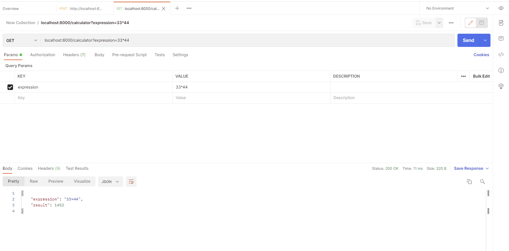

#  Test from MOQO

---

This is a repository for test from MOQO.

# How To

### Requirements:

To run this codebase, followings are needed:
- Python 3.6+
- django 3.2+

### Preparation

First clone the repository using
```
$ git clone https://github.com/shaifulislamboby/Calculator.git
```


Then setup pipenv Environment.

install pipenv
```
$ pip install pipenv
```
activate the pipenv
```
$ pipenv sync
```


### Starting

Finally, to start use this command
```
$ pipenv run python manage.py runserver
```
This will start the application in port 8000 of localhost.
We can access this via localhost:8000/admin/


# start testing it
```
$ pipenv run python manage.py test
```
 This will start the tests that is written in the tests' folder.

# Test via postman API tool
If we want to test it for more cases we can do it via postman.



### Using Docker

If docker and docker-compose is available, to start the service run. Then we can remain in the parent directory
and execute the following 
```
# build and run the django app
$ docker-compose up

# or boot in daemon mode
$ docker-compose up -d 

# get inside the docker container
$ docker exec -it the_calculator_app_1 sh

# run djnago tests
#  python manage.py test

```
In case of docker service we can also do all the curl commands stated above as our application will listen 
to local port 8000

### Testing
More test need to be added.

---

### Todos:

- [ ] add tests
- [ ] refactor
- [ ] organize things properly
- [ ] add more comprehensive comments
